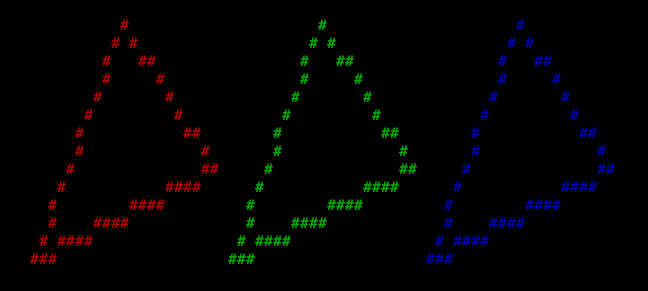

# Wireframe
**Wireframe, a 2D terminal ASCII renderer based on ncurses**
### 📦 Prerequisites
- ncurses
- gcc

### 🚀 Features:
- Quadrilaterals Rendering
- Framerate Limitation
- Anti Flickering
- Lines Rendering
- ... More

### 🔧 How to Install & Use:
- Download a Release or clone the repository by using the command:<br>```git clone https://github.com/saintsHr/wireframe```
- Extract the .zip  **(if a release)** <br>
- Open the folder and run the command: ```make```  **(if not a release)**
- Move the folder to your preference path
- While compiling, make sure to use those flags:<br>```-Ipath/to/folder/include -Lpath/to/folder/lib -lwireframe```

### 🪛 Use Examples:


